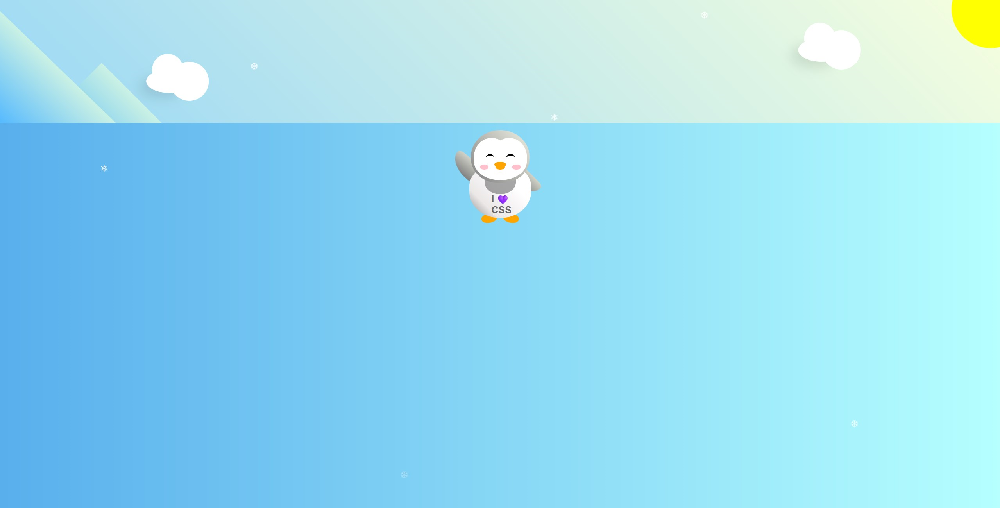

# 🐧 **Glide-Penguin**

Welcome to the **Glide-Penguin-Project**! This repository features a fun and interactive animated scene built using HTML, CSS, and JavaScript. The project demonstrates various front-end development techniques, including keyframe animations, responsive design, and dynamic interaction through JavaScript.

## 📸 Screenshot


## 🚀 Features
- **Animated Penguin**: A playful penguin character built entirely with HTML and CSS, featuring moving arms, blinking eyes, and a shirt that says "I ❤️ CSS."
- **Day/Night Mode**: Dynamic background transitions between day and night, using JavaScript to control the scene.
- **Falling Snowflakes**: Snowflakes randomly fall across the scene, creating a wintry atmosphere.
- **Moving Clouds**: Clouds drift slowly across the sky, adding depth to the scene.
- **Responsive Design**: The layout is responsive, ensuring it works well on different screen sizes.

## 📁 File Structure
- `Penguin.html`: The main HTML file that includes the structure of the animated scene.
- `styles.css`: Contains the CSS styles that define the visual appearance of the penguin, snowflakes, clouds, and background transitions.
- `script.js`: A JavaScript file that handles dynamic interactions like switching between day and night modes.

## 💻 Getting Started
To view the project locally, follow these steps:

1. Clone the repository to your local machine:
   ```bash
   git clone https://github.com/i-Glitchx/Glide-Penguin.git
   ```

2. Navigate to the project directory:
   ```bash
   cd Glide-Penguin

3. Open the `Penguin.html` file in your web browser.

## 🛠️ Technologies Used 

- **HTML**: Defines the structure of the web page and the animated elements.
- **CSS**: Handles the styling and animations for the penguin, snowflakes, and other elements.
- **JavaScript**: Adds interactivity such as day/night transitions.

## 🔮 Future Improvements 

- Add more animations to the penguin (e.g., waddling).
- Introduce user controls to switch between day and night modes.
- Add sound effects or background music for a more immersive experience.

## 🤝 Contributions 

Contributions are welcome! Feel free to fork this repository and submit a pull request with your improvements or suggestions.

## 📜 License

This project is licensed under the MIT [LICENSE](/LICENSE). See the LICENSE file for more information.
